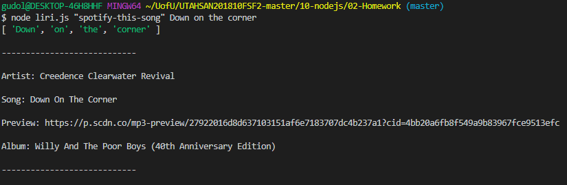
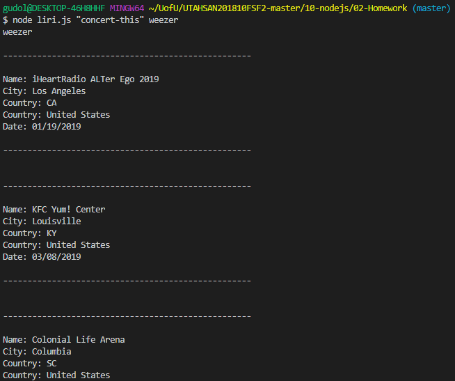
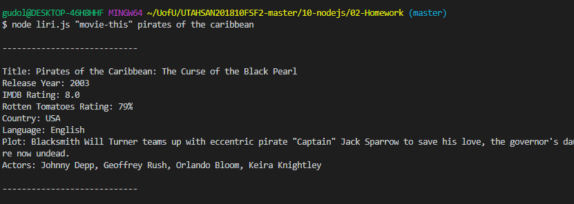
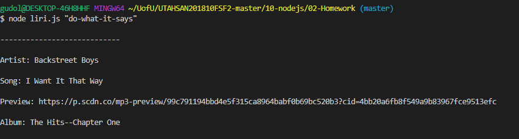
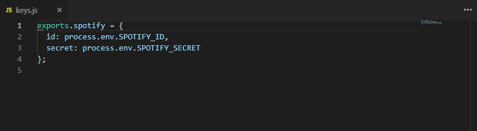

# LIRI #
### Author: Andrew Waterhouse
-----------
## App Overview ##
#
### LIRI is a parody Node application of Siri.  It is used to send requests using APIs for Bandsin town, Spotify, and OMDB to retrieve information about bands, songs, and movie titles.  
#
## Instructions for Use
### In the command line, type in one of the following:
* node liri.js "concert-this" <artist name>
    * where <artist name> is replaced with the desired query.
* node liri.js "spotify-this-song" <song title>
* Where <song name> is the desired track query.
* node liri.js "movie-this" <title>
    * Where <title> is the name of the movie.
* node liri.js "do-what-it-says"
    * Which runs the spotify feature using the text on "random.txt"
## Packages used:
> [Node.js](https://nodejs.org/en/)

> [fs](https://www.npmjs.com/package/fs)

> [request](https://www.npmjs.com/package/request)

> [Bandsintown API](http://www.artists.bandsintown.com/bandsintown-api)
    
> [node-spotify-api](https://developer.spotify.com/documentation/web-api/)
    
> [OMDb API](http://www.omdbapi.com/)
- - - -
## Screenshots of Liri in progress:
* using "concert-this":
    * 
* using "spotify-this-song":
    * 
* using "movie-this":
    * 
* using "do-what-this-says":
    * 
* the random.txt information used in do-what-this-says:
    * 